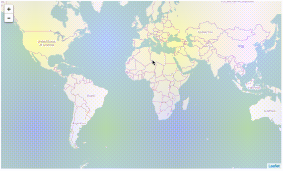

# Streaming GeoJSON with WebSockets

Use WebSockets to stream GeoJSON features to a Leaflet map.

## Quick Start

### 1. Create a script 

Write a script that generates a line-delimited stream of GeoJSON features
to stdout. This can be written in any language.

    #!/bin/bash
    fio cat countries.shp \
        | rio zonalstats --sequence -r elevation.tif

Make sure it's executable (`chmod +x script.sh`)

### 2. Start a websocket server

Download [websocketd](https://github.com/joewalnes/websocketd) and fire up a server. 

    websocketd --port=3021 script.sh

This will begin executing your script as soon as a client connects to it.

### 3. Open in a browser

Open `index.html` in any modern web browser. You should see the results drawn on the map
as they stream in. 

### Other implementations
[leaflet-geojson-stream](https://github.com/tmcw/leaflet-geojson-stream) uses HTTP 
for streaming.

